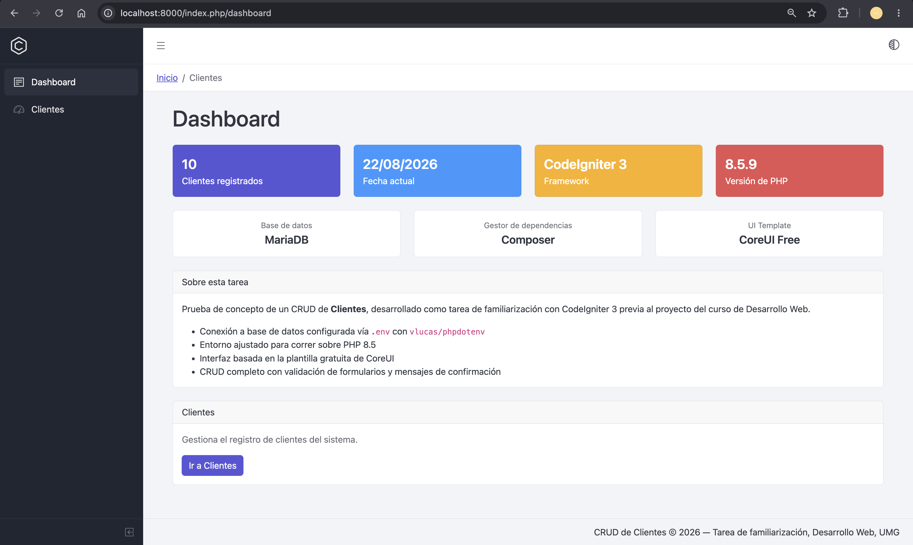
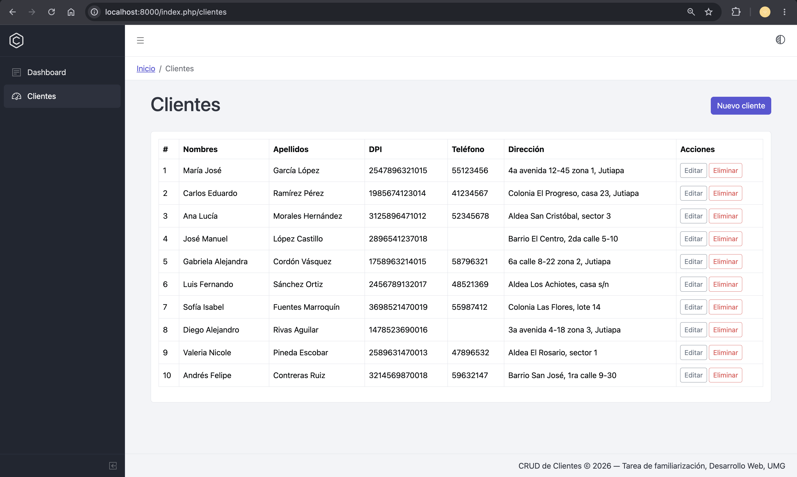
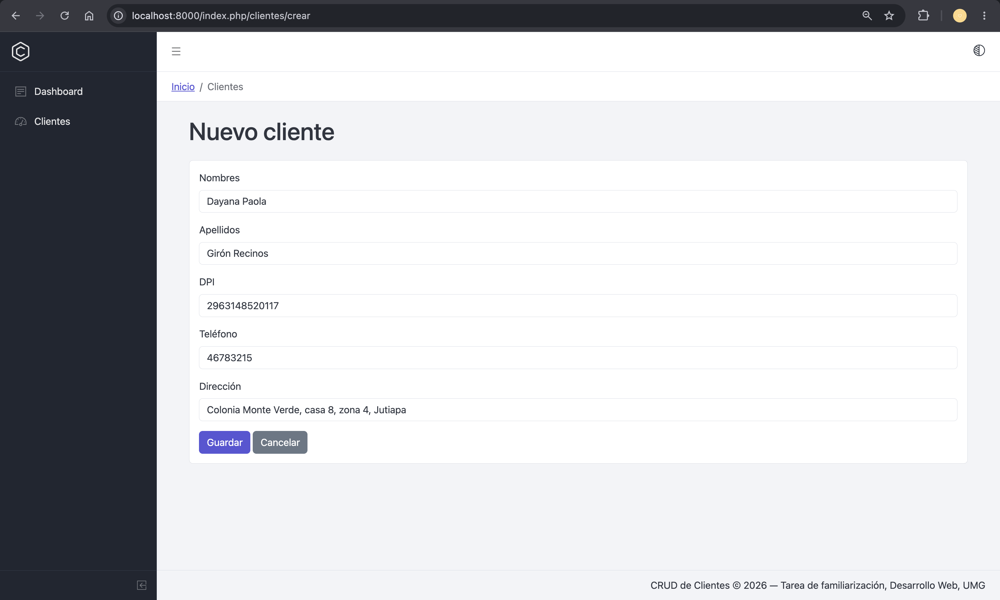
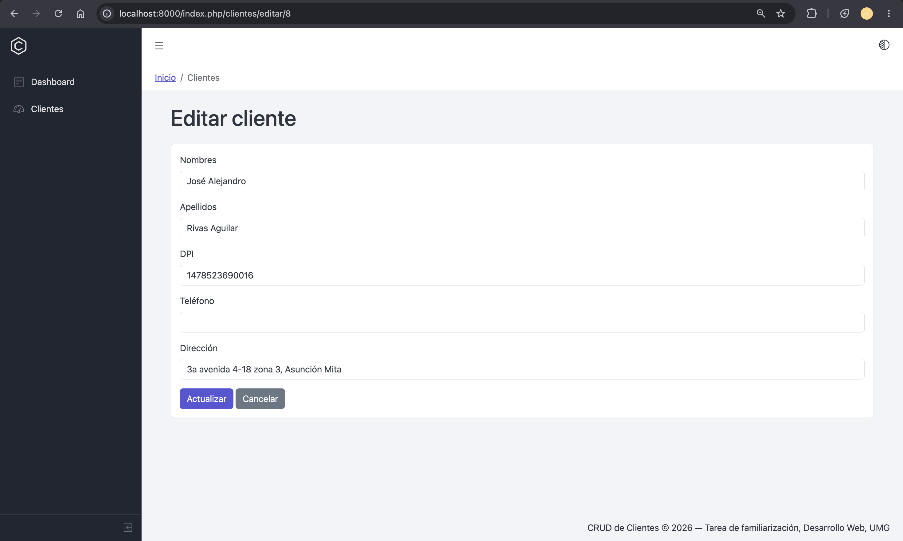
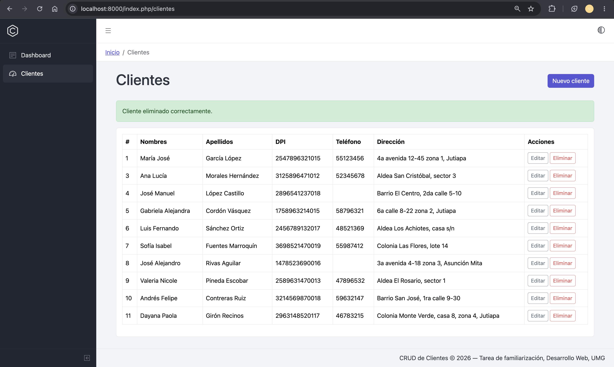
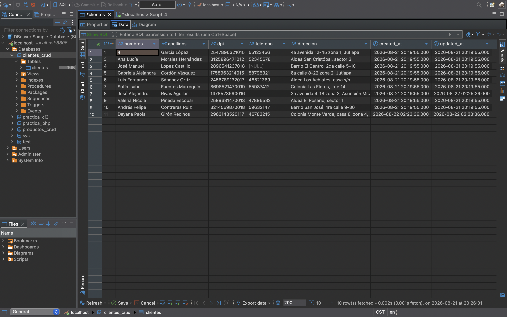

# CRUD de Clientes — CodeIgniter 3

Prueba de concepto de un sistema CRUD (Crear, Consultar, Actualizar, Eliminar) para la gestión de clientes, desarrollado como tarea de familiarización con CodeIgniter 3 previa al proyecto del curso de Desarrollo Web (Universidad Mariano Gálvez de Guatemala, Campus Jutiapa).

## Stack utilizado

- **Framework** — CodeIgniter 3 (3.1-stable)
- **Lenguaje** — PHP 8.5
- **Base de datos** — MariaDB
- **Gestor de dependencias** — Composer
- **Variables de entorno** — vlucas/phpdotenv v5.6.4
- **Interfaz** — Plantilla CoreUI Bootstrap Admin Template (versión gratuita)
- **Control de versiones** — Git / GitHub

## Requisitos

- PHP 7.2.5 o superior (probado sobre PHP 8.5)
- Composer
- MariaDB o MySQL
- Un cliente de base de datos como DBeaver (opcional, para administrar la base visualmente)

## Instalación

Clona el repositorio y entra a la carpeta del proyecto.

```bash
git clone <URL-del-repositorio>
cd <carpeta-del-proyecto>
```

Instala las dependencias con Composer.

```bash
composer install
```

## Configuración

El proyecto usa un archivo `.env` para mantener las credenciales de la base de datos fuera del control de versiones.

1. Copia el archivo de plantilla.

```bash
cp .env.example .env
```

2. Completa `.env` con tus datos reales.

```
DB_HOSTNAME=localhost
DB_USERNAME=root
DB_PASSWORD=tu_password
DB_DATABASE=clientes_crud
```

3. Verifica que `application/config/config.php` tenga el `base_url` configurado explícitamente (necesario para el servidor embebido de PHP, que no soporta la autodetección automática de CodeIgniter).

```php
$config['base_url'] = 'http://localhost:8000/';
```

## Base de datos

El proyecto incluye el script de creación de la tabla en `database/schema.sql`.

Impórtalo con DBeaver (clic derecho sobre tu conexión → SQL Editor → Open SQL Script → selecciona `database/schema.sql` → Execute SQL Script), o desde la terminal.

```bash
mysql -u root -p < database/schema.sql
```

## Ejecución

Levanta el servidor de desarrollo integrado de PHP desde la raíz del proyecto.

```bash
php -S localhost:8000
```

Accede a la aplicación en el navegador.

- Dashboard — `http://localhost:8000/index.php/dashboard`
- Listado de clientes — `http://localhost:8000/index.php/clientes`

## Problemas encontrados

Durante el desarrollo surgieron varios problemas, principalmente relacionados con la combinación de PHP 8.5, macOS, y el servidor de desarrollo embebido de PHP (que se comporta distinto a un entorno con Apache o Nginx). A continuación se documenta cada uno, su causa y su solución.

**1. Fallo al iniciar sesión (`mkdir(): Invalid path`)**

CodeIgniter 3 intenta resolver automáticamente una carpeta temporal para las sesiones cuando `sess_save_path` está en `NULL`, pero esa resolución fallaba en este entorno. Se solucionó apuntando explícitamente a una carpeta escribible del proyecto.

```php
$config['sess_save_path'] = APPPATH . 'cache';
```

**2. Las variables del `.env` no llegaban a `getenv()`**

Desde la versión 5, `vlucas/phpdotenv` dejó de llenar `getenv()`/`putenv()` automáticamente por razones de seguridad — solo llena `$_ENV`. Se solucionó recorriendo manualmente las variables cargadas y asignándolas con `putenv()` en `index.php`.

```php
$variables = $dotenv->load();
foreach ($variables as $nombre => $valor) {
    putenv("$nombre=$valor");
}
```

**3. `base_url()` generaba enlaces sin el puerto correcto**

La autodetección automática de `base_url` en CodeIgniter 3 depende de `$_SERVER['SERVER_ADDR']`, una variable que el servidor embebido de PHP no define (a diferencia de Apache). Esto generaba URLs sin puerto (`http://localhost/` en vez de `http://localhost:8000/`), provocando errores de conexión rechazada. Se solucionó fijando el valor explícitamente en `config.php`.

**4. Enlaces de navegación rotos por confundir `base_url()` con `site_url()`**

`base_url()` no agrega `index.php` a la ruta, mientras que `site_url()` sí — y sin `.htaccess`/mod_rewrite activo, `index.php` es indispensable para que el enrutador de CodeIgniter resuelva la petición. Los enlaces internos (`<a href>` de navegación) se corrigieron para usar `site_url()`, dejando `base_url()` reservado para archivos estáticos (CSS, JS, imágenes).

**5. Función `base_url()` indefinida**

`base_url()` y `site_url()` pertenecen al URL Helper de CodeIgniter, que no se carga automáticamente por defecto. Se solucionó agregándolo al autoload.

```php
$autoload['helper'] = array('url');
```

**6. Propiedad `$this->db` indefinida en el modelo**

La librería de base de datos tampoco se carga automáticamente por defecto. Se solucionó agregándola al autoload.

```php
$autoload['libraries'] = array('database');
```

## Reflexión técnica

**1. ¿Qué fue lo que más te costó entender del framework?**

La parte que representó mayor curva de aprendizaje fue la interacción entre las distintas capas de configuración de CodeIgniter 3 como el autoload de helpers y librerías, las variables de entorno y la resolución de URLs porque varias fallan de forma silenciosa o con mensajes de error poco directos. Entender que CodeIgniter 3 no carga casi nada por defecto, a diferencia de frameworks más modernos, fue clave para poder depurar estos problemas con criterio en vez de por ensayo y error.

**2. ¿Qué parte de la estructura del proyecto te pareció más importante?**

La separación entre `application/config/`, `application/models/`, `application/controllers/` y `application/views/` es la columna vertebral del framework, pero en la práctica, el archivo `autoload.php` resultó ser el más determinante porque de él depende que funcionalidades tan básicas como `base_url()` o el acceso a la base de datos (`$this->db`) estén disponibles sin tener que cargarlas manualmente en cada controlador.

**3. Explica con tus propias palabras cómo funciona una petición desde que el usuario realiza una acción hasta que obtiene una respuesta.**

Cuando el usuario visita una URL como `index.php/clientes/editar/5`, la petición entra por `index.php` que inicializa el framework y delega el enrutamiento a `application/config/routes.php`. CodeIgniter interpreta el primer segmento de la URL como el controlador (`Clientes`), el segundo como el método (`editar`) y el resto como parámetros (`5`). El controlador ejecuta la lógica correspondiente, típicamente consultando el modelo (`Cliente_model`) que se comunica con la base de datos a través del Query Builder de CodeIgniter. Con los datos obtenidos, el controlador carga una o varias vistas, pasándoles la información necesaria y CodeIgniter combina ese HTML generado en la respuesta final que se envía de vuelta al navegador del usuario.

**4. Menciona al menos 3 buenas prácticas que encontraste durante tu investigación y explica por qué son importantes.**

- **Separar credenciales del código fuente mediante variables de entorno** — evita que información sensible (contraseñas de base de datos) quede expuesta en un repositorio público y permite que cada entorno (desarrollo, producción) use su propia configuración sin modificar el código.
- **Usar los helpers del framework (`form_open()`, `site_url()`) en vez de escribir HTML plano** — no solo ahorra trabajo, sino que activa automáticamente mecanismos de seguridad como la protección CSRF, que se pierden si se construye el HTML manualmente.
- **Versionar `composer.lock` en aplicaciones (a diferencia de librerías)** — garantiza que cualquier persona que clone el proyecto instale exactamente las mismas versiones de las dependencias, evitando inconsistencias entre entornos.

**5. Menciona al menos un problema técnico que encontraste y explica cómo lo solucionaste.**

Uno de los problemas más representativos fue que las variables del archivo `.env` no llegaban a `getenv()` dentro de la aplicación, a pesar de que la librería `phpdotenv` cargaba el archivo sin errores. Investigando el comportamiento de la librería se determinó que desde su versión 5, ya no llena automáticamente `getenv()`/`putenv()` por razones de seguridad, sino que solo llena la variable superglobal `$_ENV`. La solución fue recorrer manualmente el arreglo devuelto por `$dotenv->load()` y asignar cada variable con `putenv()`, replicando el comportamiento que se esperaba por defecto.

**6. ¿Qué aprendiste durante esta actividad que consideras que te será útil para el proyecto del módulo?**

Aprendí a diagnosticar errores de CodeIgniter 3 de forma sistemática, revisando el rastro (`Backtrace`) del error hasta identificar el archivo y la línea exacta, en vez de asumir la causa por el mensaje superficial. También entendí en profundidad la diferencia entre `base_url()` y `site_url()`, la importancia de declarar correctamente el autoload de helpers y librerías y cómo estructurar un controlador para conservar los datos que el usuario ingresó cuando falla una validación, un detalle que mejora considerablemente la experiencia de uso del sistema.

## Capturas de pantalla

**Dasboard**



**Listar clientes**



**Crear cliente**



**Editar cliente**



**Eliminar cliente**



**Base de datos en MariaDB**

